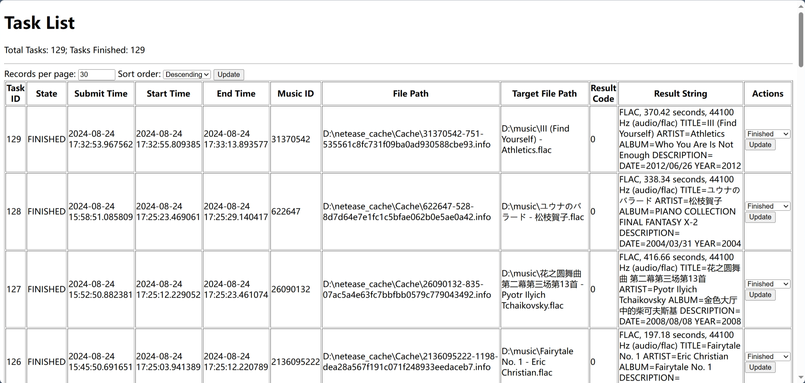

# NetEase Cloud Music Cache Convertor

> If purchase is not meant ownership, piracy is not illegal possession.

AND

> USE IT ON YOUR OWN RISK

AND

> I do believe my code is easy to read, debug, and extend. If you find bugs and consider them hard to fix, welcome to raise an issue.

## What

A simple set of scripts to 

- Continuously convert the music caches into music files where
    
    - Sound Track is handled ✔
    - Cover is handled ✔
    - Meta data (e.g., title, artists, release date) is handled ✔
    - Lyrics ❌

- A web panel to display / restart the tasks

## How to use

0. install the requirements `pip install -r requirements.txt`

1. write your configuration at `config.py`

2. start the file watcher by `python file_watcher.py`

3. start the task executer by `python task_executor.py`

4. start the web panel by `python web.py`

5. play the music

The music caches will be automatically converted into normal music files as your wish.

## Implementation/Configuration Detail

1. **File watcher** listens on the cache folder (pointed by `MUSIC_CACHE_FOLDER_PATH` in the `config.py`).

2. Once a new cache file is ready, **File watcher** submits it into the database (pointed by `DB_URL` in the `config.py`).

3. **Task Executor** listens on the database (seeking tasks with status = `SUBMITTED`), performs the cache convertion operation, outputs the music files into the target folder (pointed by `MUSIC_TARGET_FOLDER_PATH` in the `config.py`).

4. **Web Panel** can change the state of a task and, thus, restart a task if you manually switch the state into `SUBMITTED` in case of failure.

